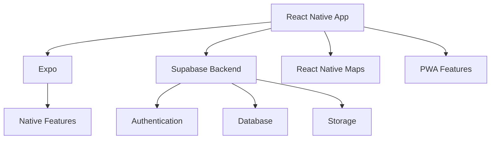
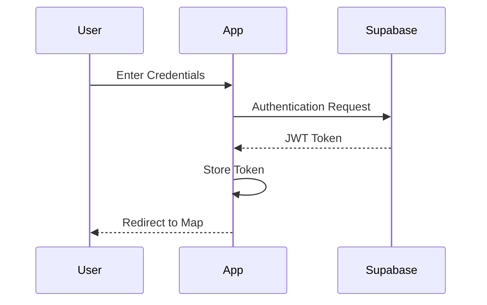
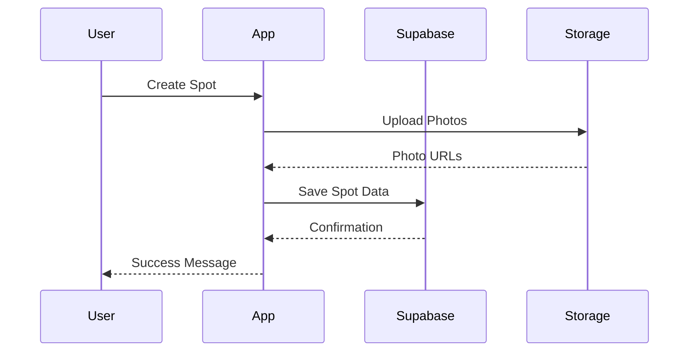

# Shred Path Architecture Overview

## System Architecture

### High-Level Overview



## Core Technologies

### Frontend
- **React Native**: Cross-platform mobile development
- **Expo**: Development and deployment tooling
- **React Navigation**: Navigation management
- **React Native Maps**: Map integration
- **React Native Reanimated**: Smooth animations
- **AsyncStorage**: Local data persistence

### Backend (Supabase)
- **Authentication**: User management and sessions
- **PostgreSQL Database**: Data storage
- **Storage Bucket**: Media file storage
- **Real-time Subscriptions**: Live updates
- **Row Level Security**: Data access control

## Application Layers

### 1. Presentation Layer
- **Components**: Reusable UI elements
- **Screens**: Main view containers
- **Navigation**: Route management
- **Theme**: Styling and design system

### 2. State Management
- **Context API**: Global state management
- **Local State**: Component-level state
- **Persistence**: Local storage management

### 3. Business Logic
- **Hooks**: Custom business logic
- **Services**: API integration
- **Utils**: Helper functions
- **Validators**: Data validation

### 4. Data Layer
- **Supabase Client**: API communication
- **Models**: Data structures
- **Transformers**: Data formatting
- **Cache**: Local data caching

## Key Features Implementation

### Authentication Flow


### Spot Management Flow


## Data Models

### Profile Schema
```typescript
interface Profile {
  id: string;
  displayName: string;
  avatarUrl?: string;
  experienceLevel: 'beginner' | 'intermediate' | 'advanced';
  bio?: string;
  createdAt: Date;
  updatedAt: Date;
}
```

### Spot Schema
```typescript
interface Spot {
  id: string;
  name: string;
  description?: string;
  location: {
    latitude: number;
    longitude: number;
  };
  difficulty: 'beginner' | 'intermediate' | 'advanced';
  spotTypes: string[];
  photos: string[];
  createdBy: string;
  createdAt: Date;
  updatedAt: Date;
}
```

## Security Architecture

### Authentication
- JWT-based authentication
- Secure token storage
- Session management
- Password recovery flow

### Data Security
- Row Level Security policies
- Input validation
- SQL injection prevention
- XSS protection

### API Security
- Rate limiting
- CORS configuration
- API key management
- Request validation

## Performance Considerations

### Optimization Strategies
1. **Image Optimization**
   - Lazy loading
   - Progressive loading
   - Caching strategy
   - Compression

2. **Map Performance**
   - Marker clustering
   - Viewport-based loading
   - Cache management
   - Debounced updates

3. **State Management**
   - Selective updates
   - Normalized data
   - Optimistic updates
   - Background syncing

4. **Network**
   - Request batching
   - Data prefetching
   - Offline support
   - Error handling

## PWA Implementation

### Features
- Offline functionality
- Push notifications
- Home screen installation
- Background sync

### Caching Strategy
- Runtime caching
- Precaching
- Network-first strategy
- Cache-first strategy

## Development Workflow

### Environment Setup
1. Development
2. Staging
3. Production

### CI/CD Pipeline
- Automated testing
- Build optimization
- Deployment automation
- Version management

## Monitoring and Analytics

### Performance Monitoring
- Load times
- API response times
- Error tracking
- Usage metrics

### User Analytics
- Feature usage
- User engagement
- Error reporting
- Feedback collection

## Future Considerations

### Scalability
- Horizontal scaling
- Cache optimization
- Database indexing
- Load balancing

### Feature Expansion
- Social features
- Advanced search
- Gamification
- Community features

---

This architecture document is continuously updated as the project evolves. For implementation details, refer to specific feature documentation in the docs directory. 